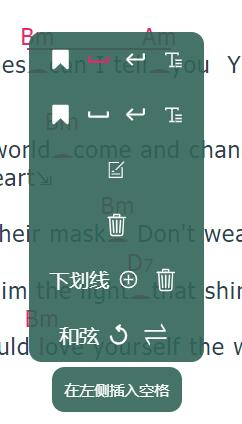

# 星河曲谱 / Antares Sheet

## 效果展示
- 网页效果（PC）

- 打印效果（优化了网页打印）

## 功能
查看、制作数字曲谱
- 曲谱查看
  - 曲谱信息
    - 展示曲谱标题、歌手、制谱人等信息
    - 展示曲谱和弦、节奏型
    - 展示指法、歌词与和弦
      - 指法谱显示
        - 元素
          - TAB标记
          - 拍号
          - 小节，小节号
          - 指法、扫弦、琶音、闷音
          - 节奏线（暂不支持三连音等）
          - 重复符号
        - 自适应尺寸
      - 和弦谱显示
        - 标记对应文字与和弦
        - 支持下划线表示细分小节
    - 快速查看和弦指法
    - 模拟演奏和弦
      - 支持不同音色
      - 支持变调夹
    - 节奏型演示/播放（未完成）
    - 分页展示（已删除，用处不大，打印功能可替代它）
    - 打印
  - 小工具
    - 自动滚动
    - 缩放
    - 节拍器
      - bpm调整
      - 节奏型调整（未完成）
- 曲谱制作
  - 账户管理（未完成）
  - 曲谱存取，版本管理（未完成）
  - 曲谱信息编辑
    - 和弦列表、节奏型列表（节奏型未完成）
      - 选择面板
      - 和弦库、节奏型库
        - 查找、制作、管理
    - 和弦谱
      - 歌词编辑
        - 自动获取歌词
        - 歌词格式化
      - 和弦、下划线编辑
        - 好用的交互！
        - 辅助和弦预测（未完成）
    - 指法谱
      - 编辑制作（未完成）
  - 音乐播放器
    - 播放音乐
    - 可调整速度、曲调
    - 可添加标记，快速跳转
      - 自定义标记名称，快速移动标记位置等
      - 快捷键生成、跳转标记
    - 和弦自动提取（未完成，没有找到开源的和弦提取工具）

## 使用
### 编辑器
#### 编辑模式
##### 基础编辑
- 大多节点双击可以编辑内容，右键打开菜单进行各种操作
  - 在和弦上双击能快速添加下划线
  - 
- 和弦上单击可以播放和弦

##### 拖拽和弦
- 和弦工具
  - 位于左侧，展示了已固定的和弦
  - 点击编辑可以添加固定和弦，软件会根据当前调式推荐一批和弦，也可以用和弦搜索功能
    - 拖拽固定和弦可以进行排序
  - 拖拽和弦到文本上可以添加和弦，拖拽到和弦上可以覆盖和弦
- 快捷编辑
  - 按住Ctrl拖拽，可以快速复制和弦
  - 按住Shift拖拽，可以快速复制和弦
  - 按住Alt左右拖拽，可以快速左右平移和弦

##### 快捷键
- 基础编辑
  - Tab：快速在左侧添加空格
    - +Shift：快速在右侧添加空格
  - Delete/R键：删除节点
  - ~键：还原和弦为文本
  - Enter键：快速在右侧添加换行
    - +Shift：改为在左侧
  - U/J键：添加/删除下划线
- 添加/修改和弦
  - 数字键1-7对应了I到VII级和弦，鼠标悬浮于文本/和弦上，按下按键即可
    - 再次按下可以切换对应级数和弦的大小调
    - 以C大调为例，1-7分别对应C、Dm、Em、F、G、Am、Bm和弦
    - 如和弦是C和弦，再次按下1则会修改为Cm和弦

#### 音乐播放器
##### 快捷键
- 播放/暂停：空格
- 添加标记：W
- 跳转到前/后一个标记：Q/E
- 在进度条上按住Ctrl滚动滚轮可以放大缩小
    
## 组件
- 曲谱格式
  - 格式规定
  - 解析曲谱文本为曲谱树
  - 转换曲谱树为曲谱文本
- 曲谱渲染
  - 渲染曲谱树
- 播放器
  - 乐器模拟
    - 模拟乐器演奏
  - 曲谱播放
    - 按照标定节奏和和弦演奏曲谱
  - 音乐播放
    - 播放音频文件
- 曲谱制作
  - 交互增删改节点
  - 格式校验
  - 快捷键
- 教程
  - 教程展示
  - 教程预制
  - 教程进度记录

## 体验
- 网页对pc和mobile端分别适配
- 用户
  - 提供收藏夹
  - 提供历史查看
  - 提供曲谱评分
- 曲谱查看
  - 优势
    - 问题：图片谱的格式参差不齐，字体大小各不相同，对移动端不友好
    - 解决：规定数字曲谱排版格式，提供调整的接口，对移动端单独设计排版，保证字体大小和密度适当
    - 问题：图片谱不方便转调，不同用户对调式要求不同
    - 解决：数字曲谱可以轻易转调，并且可以保存上次转调
    - 问题：图片谱不知道节奏型如何演奏，和弦可能按错却不知
    - 解决：数字曲谱可以示范和弦与节奏型方便学习对比
    - 问题：图片谱一般是A4大小，分页，不方便翻页查看
    - 解决：数字曲谱无需分页，可完成翻阅，并且提供分页打印的功能
- 曲谱制作
  - 优势
    - 问题：图片谱制作需要PS、播放器（riffstation）以及乐器（可选），需要反复切换
    - 解决：数字曲谱制作中全部合并
    - 问题：图片谱需要PS基础
    - 解决：数字曲谱制作无需PS基础，但有一定学习成本
    - 问题：制作图片谱需要用到播放器，并且一般的播放器不方便扒谱（扒谱需要用到调速、反复、和弦提取等功能）
    - 解决：数字曲谱内嵌播放器，提供基础功能，但和弦提取难度较高暂不考虑制作
    - 问题：制作图片谱一般需要乐器辅助，确认和弦是否正确
    - 解决：数字曲谱内嵌乐器模拟，可以方便测试
    - 问题：图片谱不方便修改，需要用到图像处理软件
    - 解决：提供数字曲谱编辑器，可方便地修改
  - 体验
    - 播放器
      - 位于页面下方，可折叠隐藏，可手动调节高度
      - 拖拽加载音频
      - 可视化波形
      - 播放暂停，添加标记
      - 跳转到标记
      - 缩放和缩放拖拽条
      - 快捷键
    - 编辑
      - 添加和弦通过拖拽
      - 如果需要在文字之前/后添加和弦？
        - 方案1：放置和弦后提供按钮/快捷键，进行左移右移
        - 方案2：提供更便利添加空格的方法，如行首行尾按钮，行内右键菜单快速添加
        - **方案3：通过和弦级数快速指定？应该非常快！**
      - 如果和弦放偏，可以快速编辑
        - 按住shift可以移动和弦
      - 如果和弦相同，可以快速复制和弦
        - 按住ctrl可以复制和弦
      - 按住alt左右拖动可以前后移动和弦
        - 同时按住ctrl可复制
      - 歌曲A段或B段重复时，可以快速复制
        - 方案1：通过和弦预测
        - 方案2：提供段落复制
      - 为了统一格式，提供一套规范格式检测提示
        - 每行的文字数不能太少或太多
        - 主歌副歌间可以加一行空行（空行检测）
      - 撤销重做？
        - 方案1：每次操作前存储文档，简单但耗内存
        - 方案2：每个操作提供反操作...需要把每个操作封装
      - 智能和弦预测
        - 添加一个和弦，会自动附上最合适的和弦
        - 帮助查找歌曲结构可能的问题（比如重复段落和弦大致相同，但存在差异，可能是遗漏了）
        - 查找可能的和弦标注点，快速标注

# IDEA
- 突然想到，给不同和弦加上颜色是不是很炫酷
  - 再整一个节拍器，可以随节拍换颜色
  - 颜色可以与和弦级数有关
- 为了体现可定制性，添加色板实时修改主题颜色，实时修改间距和字体
- 为了打印方便，更新打印时的自动排版

# 需求
- 目前还不能添加纯和弦
- 撤销功能
- 转调后指法的处理
  - 可以的话，指法中有和弦可以进行转调，其余部分隐藏
  - 或者替代方案，给一组备用和弦
- 已知旋律音高范围和用户音域，可以得到一组合适的选调
  - 已知旋律音高范围，但只知道用户对某些歌曲的选调，能否推测合适的选调
- 状态暂存
  - 保存工具栏状态
- 节拍器与和弦播放
  - 加载失败时手动重新加载
  - 节拍器预设
  - 支持自定义节拍器节奏
  - 更方便的节拍器调整
- 智能和弦预测
  - 根据上下文的和弦，猜测需要新增的和弦是什么
  - 如果整段的歌词相同，一键生成
- 编辑器页面太复杂了，拆分一下
- 编辑文本时，前后串联到一起编辑

# Bug
- Alt拖拽和弦，和弦在文件起始时不能再向前拖动
- 对英文歌曲，中间插入的和弦，在编辑歌词时会不正确地将空格去除...这个不太好处理了
- 删除下划线时，只考虑了删除右侧下划线，而不能删除位于左侧的下划线
- 有下划线时，alt拖拽朝下划线外时会出错
- 节点全部删除后交互都会失效...也许应该弄一个一键添加按钮
- 纯和弦与普通和弦混合时，下划线会出现跨越的情况

# 开发
- vue + vite
- 部分图标来自Iconfont
- 音频处理
  - 使用JS原生的Audio相关功能，如Audio、AudioContext、AudioNode等等
    - [Understanding The Web Audio Clock](https://sonoport.github.io/web-audio-clock.html)