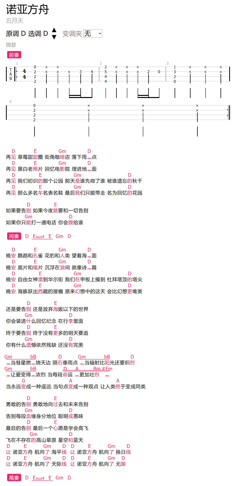
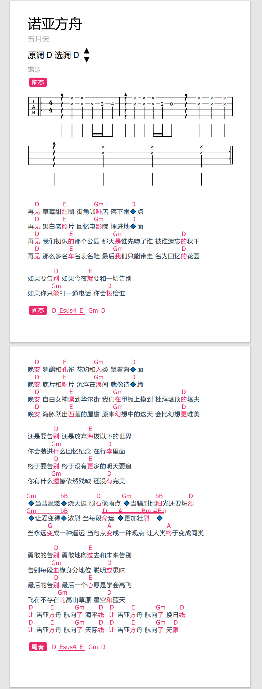

# 数字曲谱 Vue CLI
- 网页效果（PC）

- 打印效果（优化了网页打印）

## 功能
查看、制作数字曲谱
- 曲谱查看
  - 曲谱信息
    - 展示曲谱标题、歌手、制谱人等信息
    - 绘制曲谱和弦、节奏型
    - 展示指法、歌词与和弦
    - 快速查看和弦
    - 快速播放和弦
    - 节奏型演示/播放
    - 分页展示/打印
    - 修改乐器
  - 小工具
    - 自动滚动
    - 缩放
    - 节拍器
      - bpm调整
      - 节奏型调整
- 曲谱制作
  - 账户管理
  - 曲谱存取，版本管理
  - 曲谱信息编辑
    - 和弦列表、节奏型列表
      - 选择面板
      - 和弦库、节奏型库
        - 查找、制作、管理
  - 和弦谱
    - 歌词编辑
      - 自动获取歌词
      - 歌词格式化
    - 和弦、下划线编辑
      - 交互问题
      - 和弦预测？
  - 指法谱
  - 播放器
    - 播放音频
    - 和弦提取？
    
## 组件
- 曲谱格式
  - 格式规定
  - 解析曲谱文本为曲谱树
  - 转换曲谱树为曲谱文本
- 曲谱渲染
  - 渲染曲谱树
- 播放器
  - 乐器模拟
    - 模拟乐器演奏
  - 曲谱播放
    - 按照标定节奏和和弦演奏曲谱
  - 音乐播放
    - 播放音频文件
- 曲谱制作
  - 交互增删改节点
  - 格式校验
  - 快捷键
- 教程
  - 教程展示
  - 教程预制
  - 教程进度记录

## 体验
- 网页对pc和mobile端分别适配
- 用户
  - 提供收藏夹
  - 提供历史查看
  - 提供曲谱评分
- 曲谱查看
  - 优势
    - 问题：图片谱的格式参差不齐，字体大小各不相同，对移动端不友好
    - 解决：规定数字曲谱排版格式，提供调整的接口，对移动端单独设计排版，保证字体大小和密度适当
    - 问题：图片谱不方便转调，不同用户对调式要求不同
    - 解决：数字曲谱可以轻易转调，并且可以保存上次转调
    - 问题：图片谱不知道节奏型如何演奏，和弦可能按错却不知
    - 解决：数字曲谱可以示范和弦与节奏型方便学习对比
    - 问题：图片谱一般是A4大小，分页，不方便翻页查看
    - 解决：数字曲谱无需分页，可完成翻阅，并且提供分页打印的功能
- 曲谱制作
  - 优势
    - 问题：图片谱制作需要PS、播放器（riffstation）以及乐器（可选），需要反复切换
    - 解决：数字曲谱制作中全部合并
    - 问题：图片谱需要PS基础
    - 解决：数字曲谱制作无需PS基础，但有一定学习成本
    - 问题：制作图片谱需要用到播放器，并且一般的播放器不方便扒谱（扒谱需要用到调速、反复、和弦提取等功能）
    - 解决：数字曲谱内嵌播放器，提供基础功能，但和弦提取难度较高暂不考虑制作
    - 问题：制作图片谱一般需要乐器辅助，确认和弦是否正确
    - 解决：数字曲谱内嵌乐器模拟，可以方便测试
    - 问题：图片谱不方便修改，需要用到图像处理软件
    - 解决：提供数字曲谱编辑器，可方便地修改
  - 体验
    - 播放器
      - 位于页面下方，可折叠隐藏，可手动调节高度
      - 拖拽加载音频
      - 可视化波形
      - 播放暂停，添加标记
      - 跳转到标记
      - 缩放和缩放拖拽条
      - 快捷键
    - 编辑
      - 添加和弦通过拖拽
      - 如果需要在文字之前/后添加和弦？
        - 方案1：放置和弦后提供按钮/快捷键，进行左移右移
        - 方案2：提供更便利添加空格的方法，如行首行尾按钮，行内右键菜单快速添加
        - **方案3：通过和弦级数快速指定？应该非常快！**
      - 如果和弦放偏，可以快速编辑
        - 按住shift可以移动和弦
      - 如果和弦相同，可以快速复制和弦
        - 按住ctrl可以复制和弦
      - 歌曲A段或B段重复时，可以快速复制
        - 方案1：通过和弦预测
        - 方案2：提供段落复制
      - 为了统一格式，提供一套规范格式检测提示
        - 每行的文字数不能太少或太多
        - 主歌副歌间可以加一行空行（空行检测）
      - 撤销重做？
        - 方案1：每次操作前存储文档，简单但耗内存
        - 方案2：每个操作提供反操作...需要把每个操作封装
## 一些问题
- ~~TODO: 增加效果截图~~ √
- 曲谱查看
  - ~~TODO: 转调后隐藏指法~~ √
    - 可以的话，指法中有和弦可以进行转调，其余部分隐藏
    - 或者替代方案，给一组备用和弦
  - TODO: 已知旋律音高范围和用户音域，可以得到一组合适的选调
    - 已知旋律音高范围，但只知道用户对某些歌曲的选调，能否推测合适的选调
  - ~~TODO: 更方便的工具栏，可以开关工具~~ √
  - TODO: 重构，UI和数据统一一棵树，不靠递归来更新！自己维护节点，效率会高很多！
- FIXME: 删除下划线时，只考虑了删除右侧下划线，而不能删除位于左侧的下划线
- 工具栏
  - ~~更新工具栏交互~~ √
  - 保存storage工具栏状态
  - 节拍器与和弦播放
    - ~~TODO: 动态加载音源~~ √
    - TODO: 加载失败时手动重新加载
    - ~~TODO: 显示音源加载进度~~ √
    - TODO: 节拍器预设
    - TODO: 支持自定义节拍器节奏
    - TODO: 更方便的节拍器调整
- 曲谱编辑
  - 重构！
- 音乐播放器
  - TODO: 播放器可折叠、关闭、动态加载卸载