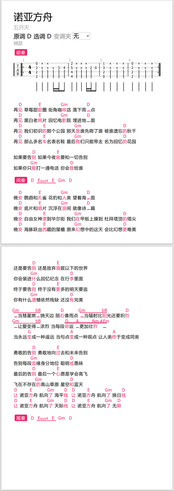

# 星河曲谱 / Antares Sheet

## 介绍
- 星河曲谱是一个开源数字曲谱项目，主要用于在网页上制作、使用和弦谱（弹唱谱，歌词+标注的和弦）
- 星河曲谱提供了以下内容
  - **atrs曲谱文件格式**：提出了一种弹唱谱的曲谱格式，通过文本表述曲谱，支持歌词、和弦标注，并且设计了扩展，提供额外的功能，如表示指弹谱
  - **曲谱查看器**：在PC和手机端查看曲谱，提供转调、自动滚动、和弦提示、打印等等常用功能
  - **曲谱编辑器**：在PC和手机端编辑曲谱（设计了两种交互模式），通过可视化界面来快速、方便地制作、编辑曲谱
  - **后端**：提供曲谱发布和在线同步，但后端不是必须的，星河曲谱可以离线运行！[后端介绍](/backend/)

## 效果展示
- 网页效果（PC）

- 打印效果（优化了网页打印）

## 使用
### 编辑器
#### 编辑模式
##### 基础编辑
- 大多节点双击可以编辑内容，右键打开菜单进行各种操作
  - 在和弦上双击能快速添加下划线
  - 
- 和弦上单击可以播放和弦

##### 拖拽和弦
- 和弦工具
  - 位于左侧，展示了已固定的和弦
  - 点击编辑可以添加固定和弦，软件会根据当前调式推荐一批和弦，也可以用和弦搜索功能
    - 拖拽固定和弦可以进行排序
  - 拖拽和弦到文本上可以添加和弦，拖拽到和弦上可以覆盖和弦
- 快捷编辑
  - 按住Ctrl拖拽，可以快速复制和弦
  - 按住Shift拖拽，可以快速复制和弦
  - 按住Alt左右拖拽，可以快速左右平移和弦

##### 快捷键
- 基础编辑
  - Tab：快速在左侧添加空格
    - +Shift：快速在右侧添加空格
  - Delete/R键：删除节点
  - ~键：还原和弦为文本
  - Enter键：快速在右侧添加换行
    - +Shift：改为在左侧
  - U/J键：添加/删除下划线
- 添加/修改和弦
  - 数字键1-7对应了I到VII级和弦，鼠标悬浮于文本/和弦上，按下按键即可
    - 再次按下可以切换对应级数和弦的大小调
    - 以C大调为例，1-7分别对应C、Dm、Em、F、G、Am、Bm和弦
    - 如和弦是C和弦，再次按下1则会修改为Cm和弦

#### 音乐播放器
##### 快捷键
- 播放/暂停：空格
- 添加标记：W
- 跳转到前/后一个标记：Q/E
- 在进度条上按住Ctrl滚动滚轮可以放大缩小
    
# 开发
- vue + vite
- 部分图标来自Iconfont
- 音频处理
  - 使用JS原生的Audio相关功能，如Audio、AudioContext、AudioNode等等
    - [Understanding The Web Audio Clock](https://sonoport.github.io/web-audio-clock.html)